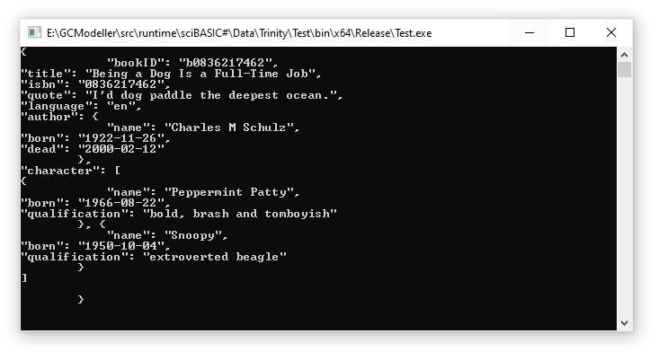
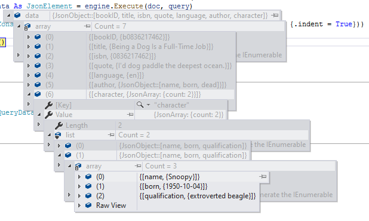

# GraphQuery

> https://github.com/storyicon/graphquery

GraphQuery is a query language and execution engine tied to any backend service. It is back-end language independent.

## Getting Started

GraphQuery consists of query language and pipelines. To guide you through each of these components, we've written an example designed to illustrate the various pieces of GraphQuery. This example is not comprehensive, but it is designed to quickly introduce the core concepts of GraphQuery. The premise of the example is that we want to use GraphQuery to query for information about library books.

### Programming With VisualBasic Code

```vbnet
Imports Microsoft.VisualBasic.Data.GraphQuery
Imports Microsoft.VisualBasic.Data.GraphQuery.Language
Imports Microsoft.VisualBasic.MIME.application.json
Imports Microsoft.VisualBasic.MIME.application.json.Javascript
Imports Microsoft.VisualBasic.MIME.Markup.HTML

' define your graph query at here
Dim queryText As String = "..."
Dim query As Query = QueryParser.GetQuery(queryText)
Dim engine As New Engine
' http get of the html document text from web server or local filesystem
Dim url As String = "..."
Dim doc As HtmlDocument = HtmlDocument.LoadDocument(url)
Dim data As JsonElement = engine.Execute(doc, query)
' debug view of the graph query result
Dim json As String = data.BuildJsonString(New JSONSerializerOptions With {.indent = True})

Call Console.WriteLine(json)
```




## Demo

Given a such html document text:

```html
<library>
<!-- Great book. -->
<book id="b0836217462" available="true">
    <isbn>0836217462</isbn>
    <title lang="en">Being a Dog Is a Full-Time Job</title>
    <quote>I'd dog paddle the deepest ocean.</quote>
    <author id="CMS">
        <?echo "go rocks"?>
        <name>Charles M Schulz</name>
        <born>1922-11-26</born>
        <dead>2000-02-12</dead>
    </author>
    <character id="PP">
        <name>Peppermint Patty</name>
        <born>1966-08-22</born>
        <qualification>bold, brash and tomboyish</qualification>
    </character>
    <character id="Snoopy">
        <name>Snoopy</name>
        <born>1950-10-04</born>
        <qualification>extroverted beagle</qualification>
    </character>
</book>
</library>
```

Then faced with such a text structure, we naturally think of extracting the following data structure from the text :

```json
{
    bookID
    title
    isbn
    quote
    language
    author{
        name
        born
        dead
    }
    character [{
        name
        born
        qualification
    }]
}
```

This is perfect, when you know the data structure you want to extract, you have actually succeeded 80%, the above is the data structure we want, we call it DDL (Data Definition Language) for the time being. let's see how GraphQuery does it:

```json
# https://www.codeproject.com/Articles/1264613/GraphQuery-Powerful-Text-Query-Language-3

graphquery
{
    bookID  css("book")|attr("id")
    title css("title")
    isbn xpath("//isbn")
    quote css("quote")
    language css("title")|attr("lang")
    author css("author") {
        name css("name")
        born css("born")
        dead css("dead")
    }
    character xpath("//character") [{
        name css("name")
        born css("born")
        qualification xpath("qualification")
    }]
}
```

As you can see, the syntax of GraphQuery adds some strings wrapped in ` to the DDL. These strings wrapped by ` are called Pipeline. We will introduce Pipeline later. Let's first take a look at what data GraphQuery engine returns to us.

```json
{
    "bookID": "b0836217462",
    "title": "Being a Dog Is a Full-Time Job",
    "isbn": "0836217462",
    "quote": "I'd dog paddle the deepest ocean.",
    "language": "en",
    "author": {
        "born": "1922-11-26",
        "dead": "2000-02-12",
        "name": "Charles M Schulz"
    },
    "character": [
        {
            "born": "1966-08-22",
            "name": "Peppermint Patty",
            "qualification": "bold, brash and tomboyish"
        },
        {
            "born": "1950-10-04",
            "name": "Snoopy",
            "qualification": "extroverted beagle"
        }
    ],
}
```

Wow, it's wonderful. Just like what we want.
